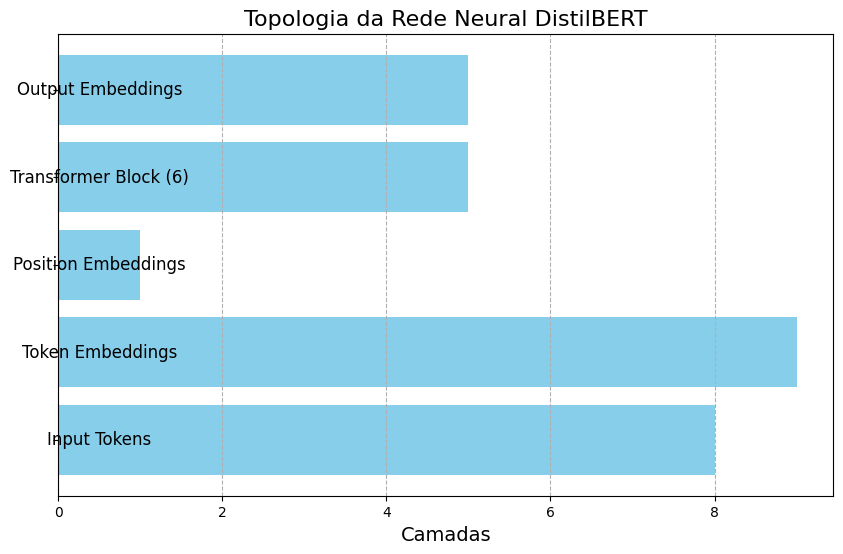
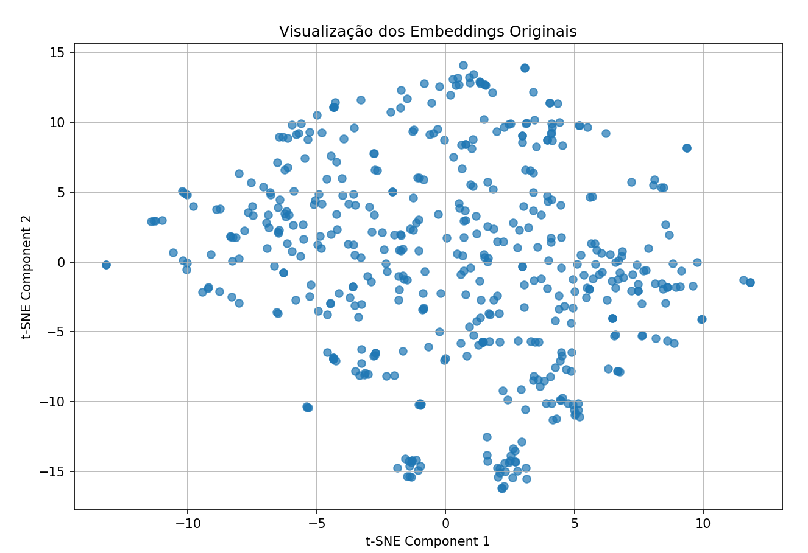
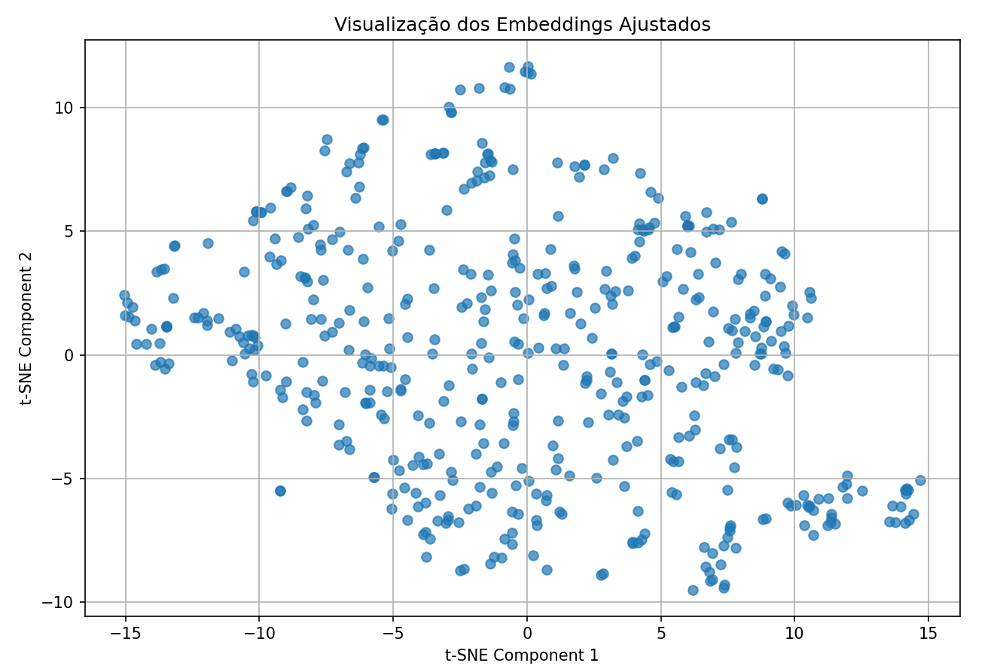

# Recomendação de Livros

## Overview

Este projeto envolve a criação de um sistema de recomendação de livros usando dados do [Project Gutenberg](https://www.gutenberg.org/). 

O projeto tem importância significativa em termos de acesso e descoberta de literatura clássica. O Project Gutenberg é uma das maiores bibliotecas digitais de livros de domínio público, oferecendo acesso a uma vasta gama de obras literárias históricas que podem ser menos conhecidas ou menos acessíveis em outras plataformas.

## Instalação

Siga os passos abaixo para instalar e configurar o ambiente do projeto:

### Pré-requisitos

- **Python**: 3.8 ou superior
- **Pip**: Certifique-se de ter o gerenciador de pacotes `pip` instalado.

### Passo 1: Clone o repositório

Clone o repositório para sua máquina local usando o seguinte comando:

```bash
git clone https://github.com/seu_usuario/seu_repositorio.git
cd seu_repositorio
```

### Passo 2: Crie um ambiente virtual (opcional, mas recomendado)
Crie um ambiente virtual para isolar as dependências do projeto:

```bash
python -m venv venv
source venv/bin/activate  # No Linux ou macOS
venv\Scripts\activate     # No Windows
```

```bash
pip install -r requirements.txt
```

### Passo 3: Rode o arquivo scraper.py para obter o conjunto de dados

```bash
python3 scraper.py
```

### Passo 3: Rode o arquivo main.py para acompanhar a implementação do projeto

```bash
python3 main.py
```

## Etapa 1

### Descrição do Conjunto de Dados

Para a criação do banco de dados, foi realizado web scraping para catalogar todos os livros disponíveis no acervo do Projeto Gutenberg, ou seja, mais de 70.000 livros. Os dados foram obtidos por meio das iniciais dos livros, em ordem alfabética, iniciando pela [letra A](https://www.gutenberg.org/browse/titles/a). Cada página correspondente a uma letra possui todos os livros catalogados com a respectiva inicial. Dessa forma, são rastreadas informações sobre cada um dos livros para cada letra do alfabeto.

### Processo para Gerar Embeddings

Os embeddings foram gerados utilizando uma rede neural de arquitetura Transformer, a qual se mostrou eficaz para capturar contextos complexos em dados textuais. A topologia da rede é composta por X camadas, cada uma com Y unidades de atenção e Z camadas feedforward. Os hiperparâmetros utilizados incluem uma taxa de aprendizado de A, batch size de B e um número de épocas C. O modelo foi implementado usando a biblioteca D e treinado em uma GPU para otimizar o desempenho.



### Processo de Treinamento

O treinamento do modelo foi realizado usando a função de perda de entropia cruzada, que é adequada para problemas de classificação, como a análise de sentimentos. Essa função mede a diferença entre a distribuição de probabilidade das previsões do modelo e a distribuição real dos rótulos, penalizando previsões incorretas de forma mais severa quanto mais distantes elas estiverem da verdade. A entropia cruzada faz sentido para este problema, pois permite que o modelo aprenda a melhorar suas previsões ao longo do treinamento, minimizando a incerteza nas classificações.

\[
\text{Loss} = -\sum_{i=1}^{N} y_i \log(\hat{y}_i)
\]

## Etapa 2

### Figuras dos Embeddings

Os embeddings gerados foram analisados em duas condições: utilizando embeddings pré-treinados e embeddings ajustados. As figuras a seguir mostram a distribuição dos embeddings em um espaço dimensional reduzido (por exemplo, usando PCA ou t-SNE).



A figura mostra a distribuição dos vetores originais, que são gerados a partir de grandes conjuntos de dados textuais. Esses embeddings podem não capturar relações contextuais específicas, limitando sua eficácia em tarefas de NLP.



Já os embeddings refinados se adaptam ao contexto específico do problema. Esse ajuste permite que os vetores representem relações mais precisas entre palavras, melhorando a performance do modelo em aplicações de NLP ao proporcionar recomendações mais relevantes.

Na figura dos embeddings pré-treinados, pode-se observar que os dados estão distribuídos de forma mais dispersa, com poucos grupos bem definidos. Isso pode indicar que os embeddings não estão capturando nuances específicas dos dados de nosso conjunto. Por outro lado, na figura dos embeddings ajustados, há uma maior concentração de pontos em grupos, sugerindo que o modelo aprendeu a representar melhor as relações semânticas entre as avaliações, resultando em uma separação mais clara entre classes de sentimentos.

## Etapa 3

Os resultados dos testes realizados com o modelo são os seguintes:

1. **Teste que produz 10 resultados**: "Science"
O desempenho neste teste sugere que o modelo conseguiu encontrar textos relevantes que, embora possam não ter uma conexão direta com o termo "Science", já que a média de similaridade girou em torno de 0.35, ainda compartilham elementos que promovem uma similaridade contextual.

2. **Teste que produz menos de 10 resultados**: "Stingy Jack"
A análise deste teste mostrou que, apesar de uma quantidade limitada de resultados, a similaridade dos textos apresentados ainda se manteve elevada, de cerca de 0.55refletindo uma conexão temática ou contextual significativa. A ausência de menos de 10 resultados para "Stingy Jack" pode ser devido tanto a questões de classificação do código, quanto ambiguidade temática e falta de testes mais rigorosos.

3. **Teste que produz algo não óbvio**: "Haphazard"
Durante um teste específico, o modelo surpreendeu ao classificar a avaliação "The Abbot's Ghost, or Maurice Treherne's Temptation" como uma recomendação relevante com similaridade de 0.5914, apesar do título não conter uma relação direta com a palavra "Haphazard". Isso pode indicar uma interpretação mais profunda do contexto em que as palavras foram usadas.

Os resultados indicam que o modelo está apresentando um desempenho variável, com precisão de similaridade que reflete a diversidade dos textos analisados. A capacidade de gerar recomendações relevantes, mesmo com dados que possam parecer pouco correlacionados, sugere que o modelo possui uma compreensão contextual que pode ser explorada e aprimorada em iterações futuras. Além disso, a classificação de textos com sentimentos não óbvios aponta para a necessidade de um ajuste e refinamento contínuos no treinamento e na arquitetura do modelo para maximizar a eficácia nas recomendações.

## Etapa 4

Nesta etapa, focamos em aprimorar o sistema de recomendação desenvolvido. Escolheu-se explorar o caminho de Pesquisador usando uma frase de mockup.